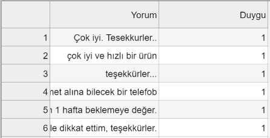

### sentiment_analysis
sentiment analysis for turkish comments

## Dataset Information

I used a dataset contains Turkish movie comments. The comments were labeled as positive or negative.

## Requirements

There are a few general library requirements for the project. 

* numpy
* scikit-learn
* scipy
* nltk

## Models

 I tried a few machine learning models and evaluated the accuracy of their predictions. End of the evaluation, the best F1 score was 0.89.
 
 * Lojistic Regression 
 * Naive Bayess
 * Random Forest
 * XGBoost
 
 

